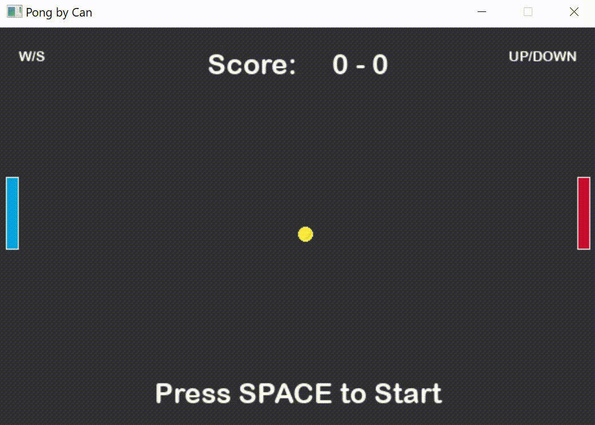
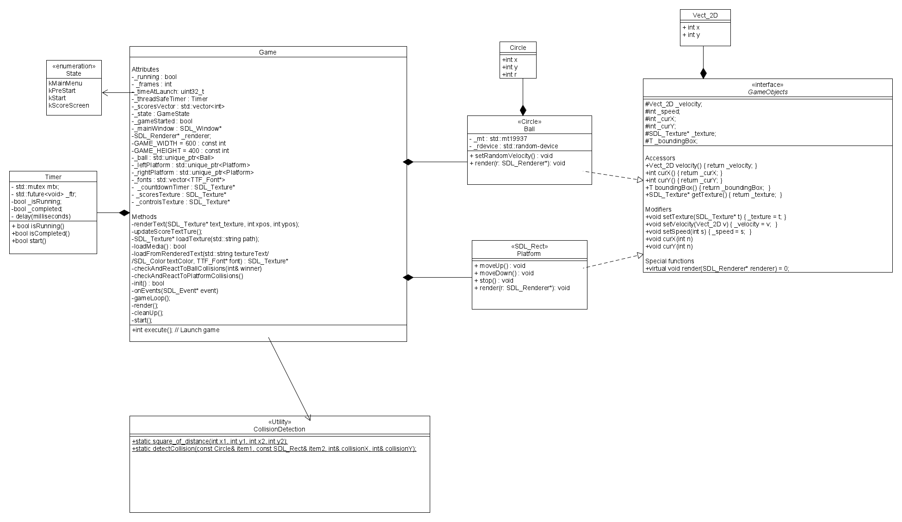

# Pong Game Project

** Version 1.0.0 **

A classic game of Pong implemented using the SDL2 library. 

This project is a submission for the Udacity C++ Nanodegree program capstone project.

---
## Expected Behavior

## Dependencies for Running Locally

* cmake >= 3.7
  * All OSes: [click here for installation instructions](https://cmake.org/install/)
* make >= 4.1 (Linux, Mac), 3.81 (Windows)
  * Linux: make is installed by default on most Linux distros
  * Mac: [install Xcode command line tools to get make](https://developer.apple.com/xcode/features/)
  * Windows: [Click here for installation instructions](http://gnuwin32.sourceforge.net/packages/make.htm)
* SDL2 >= 2.0
  * All installation instructions can be found [here](https://wiki.libsdl.org/Installation)
  * Note that for Linux, an `apt` or `apt-get` installation is preferred to building from source.
* SDL_Image >= 2.0
	* All installation instructions can be found [here](https://lazyfoo.net/tutorials/SDL/06_extension_libraries_and_loading_other_image_formats/index.php). [Here](
	https://www.libsdl.org/tmp/SDL_image/) is the official site.
* SDL_ttf >= 2.0
	* Follow the same installation procedure as SDL_Image. Download link to library is [here](https://www.libsdl.org/projects/SDL_ttf/).
* gcc/g++ >= 5.4
  * Linux: gcc / g++ is installed by default on most Linux distros
  * Mac: same deal as make - [install Xcode command line tools](https://developer.apple.com/xcode/features/)
  * Windows: recommend using [MinGW](http://www.mingw.org/)

## Basic Build Instructions

1. Clone this repo.
2. Make a build directory in the top level directory: `mkdir build && cd build`
3. Compile: `cmake .. && make`
4. Copy resources folder 
5. Run it: `./Pong .

## Gameplay instructions

Player 1 controls : W/D
Player 2 controls : UP/DOWN
Press SPACE to start the game.

## File Class Structure

## Rubric points addressed

* The project demonstrates an understanding of C++ functions and control structures.
	* 
* The project uses Object Oriented Programming techniques.
	*
* Classes use appropriate access specifiers for class members.
	*
* Class constructors utilize member initialization lists.
	*
* Classes abstract implementation details from their interfaces.
	*
* The project follows the Rule of 5.
	*
* The project uses smart pointers instead of raw pointers.
	* 
* The project uses multithreading.
	*
* A mutex or lock is used in the project.
	*